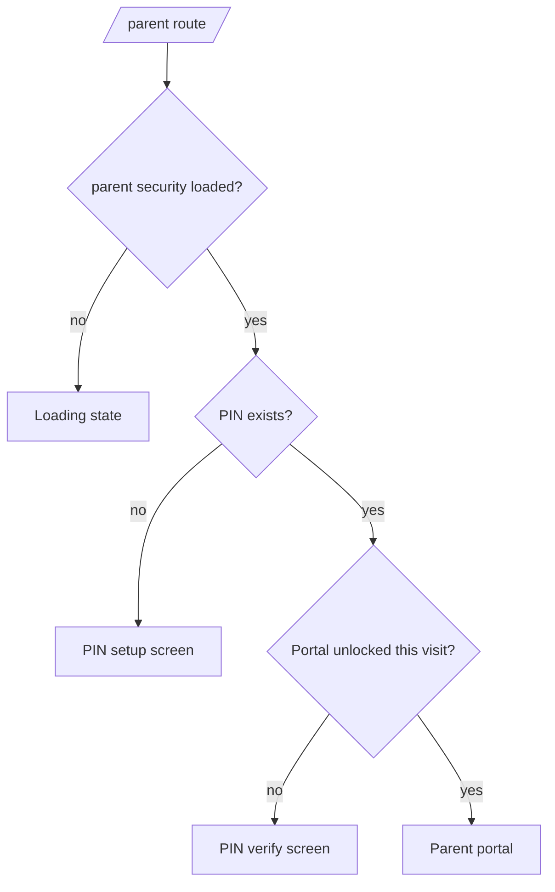
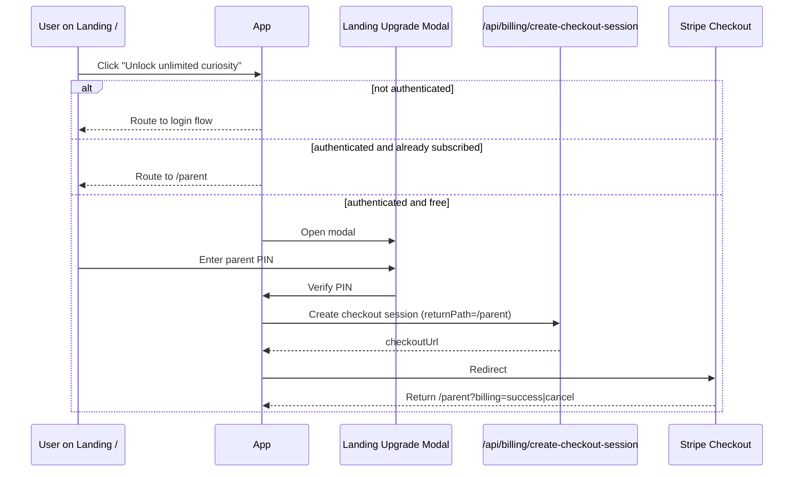

# Auth and Parent Portal Flow

- Owner: TBD
- Last updated: 2026-04-16
- Status: active
- Related docs:
	[../40-security/PARENT_PIN_SECURITY_MODEL.md](../40-security/PARENT_PIN_SECURITY_MODEL.md),
	[../50-ops/ENV_AND_DEPLOYMENT_RUNBOOK.md](../50-ops/ENV_AND_DEPLOYMENT_RUNBOOK.md)
- Related code:
	[../../src/App.jsx](../../src/App.jsx),
	[../../src/lib/familyData.js](../../src/lib/familyData.js),
	[../../src/components/LoginScreen.jsx](../../src/components/LoginScreen.jsx),
	[../../src/components/FamilyTopBar.jsx](../../src/components/FamilyTopBar.jsx),
	[../../src/components/ChildProfilesScreen.jsx](../../src/components/ChildProfilesScreen.jsx)

## Flow goals

1. Parent can authenticate reliably across local, preview, and production origins.
2. Parent-only controls are inaccessible from child screens unless explicitly entering parent route.
3. Parent route is protected by a second factor (PIN) in addition to Google session.
4. Billing upgrade paths are explicit by surface (landing/parent vs child).

## Parent authentication flow

1. App checks Supabase config.
2. App loads existing auth session.
3. If no session, show parent login screen (Google OAuth button).
4. On session, app upserts parent row and loads children + parent security fields.

## Primary route map for auth-aware behavior

1. / = landing page
2. /app = child curious surface
3. /parent = parent portal (PIN gated)
4. /get-curious = classic topic-card flow

Failure handling:

1. Missing Supabase config shows setup-required screen.
2. Auth loading and profile loading are distinct UI states.

## Parent route entry points

1. Direct URL: /parent
2. Hidden gesture from child top bar:
- long-press on child identity area routes to /parent
- route still requires PIN
3. Landing modal "Open parent portal instead" CTA

## Parent route state machine

At route /parent:

1. security loading state
2. if no parent PIN exists -> first-time create PIN screen
3. else if portal not unlocked for current visit -> PIN verify screen
4. else show parent management screen

Important behavior:

- Unlock is per current visit only (no timed carryover cache).
- New route visit requires PIN again.

## First-time PIN setup

Input rules:

1. PIN must be 4 to 8 digits.
2. Confirm PIN must match.

Storage process:

1. Generate random salt (browser crypto).
2. Hash string salt:pin with SHA-256.
3. Store hash + salt + set timestamp in parents table.

## PIN verify process

1. Read parent_pin_hash and parent_pin_salt.
2. Hash entered PIN with stored salt.
3. Compare hash equality.
4. On success, unlock parent portal for current visit.

## Failed attempt lockout

Rules:

1. 5 failed attempts -> lock for 60 seconds.
2. Lock and attempt counters are persisted in sessionStorage by parent user id.
3. Refresh does not bypass lock.

UI behavior:

1. countdown message shown while locked
2. PIN input and unlock button disabled during lock window

## Change PIN flow

Location:

- Parent portal screen under Parent Security section.

Process:

1. Parent enters current PIN.
2. Parent enters and confirms new PIN.
3. Current PIN verified against stored hash.
4. New random salt and new hash generated.
5. Parent row updated with new hash/salt/timestamp.
6. Lockout counters cleared.

## Upgrade flows by surface

### A) Child surface upgrade (/app)

1. Child hits quota or taps "Ask a grown-up".
2. Inline parent checkout modal opens.
3. Parent enters PIN in modal.
4. PIN verification succeeds.
5. Checkout session created with returnPath=/app.
6. Stripe checkout opens.
7. Return to /app?billing=success|cancel.

### B) Landing surface upgrade (/)

1. User taps "Unlock unlimited curiosity".
2. If unauthenticated: route through login first.
3. If authenticated paid user: button shows already subscribed state and routes to parent portal.
4. If authenticated free user: parent checkout modal opens.
5. Parent enters PIN in modal.
6. Checkout session created with returnPath=/parent.
7. Stripe checkout opens.
8. Return to /parent?billing=success|cancel.

## Sign-out behavior

1. Signs out Supabase session.
2. Clears parent route unlocked state.
3. Clears PIN guard attempts and lock values.

## Edge cases to test

1. Invalid OAuth redirect origin (falls back incorrectly if Supabase redirect config missing).
2. Parent route deep-link with no session.
3. Parent security fields temporarily unavailable.
4. PIN lockout persistence across page refresh.
5. PIN change while lockout state exists.

