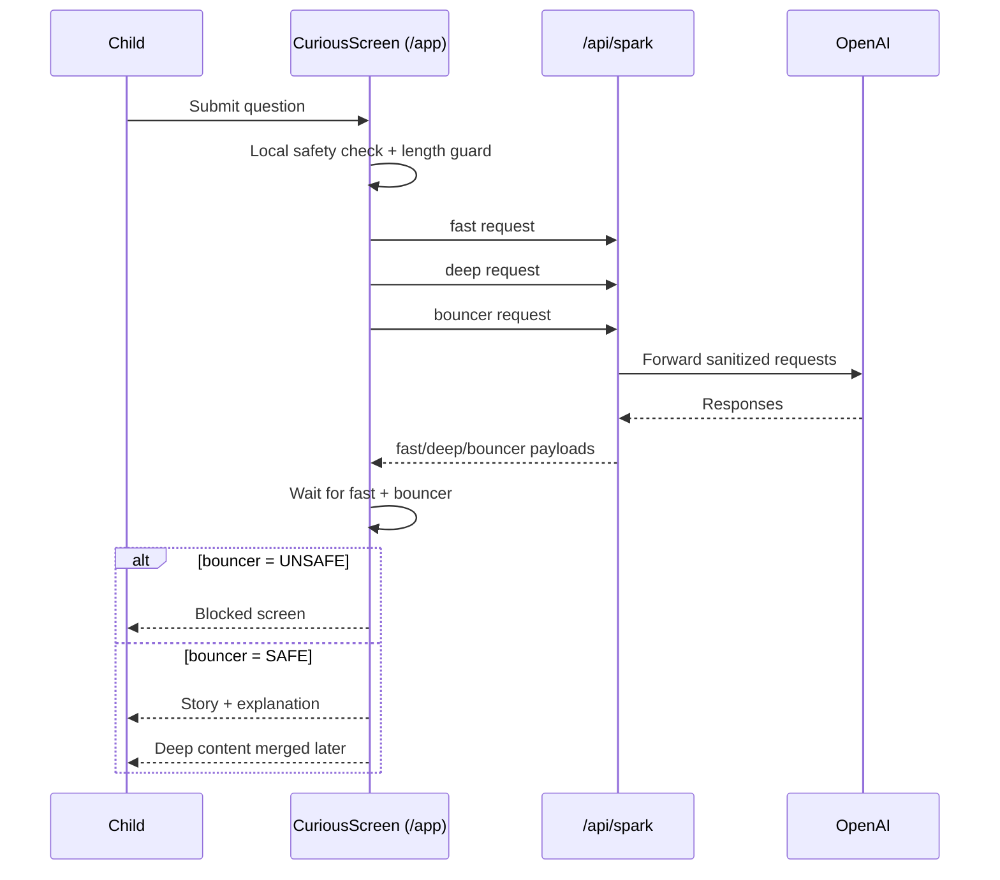

# Child Journey Flow

- Owner: TBD
- Last updated: 2026-04-23
- Status: active
- Related docs:
	[../00-product/PRODUCT_OVERVIEW.md](../00-product/PRODUCT_OVERVIEW.md),
	[AUTH_AND_PARENT_PORTAL_FLOW.md](AUTH_AND_PARENT_PORTAL_FLOW.md)
- Related code:
	[../../src/App.jsx](../../src/App.jsx),
	[../../src/components/JourneyScreen.jsx](../../src/components/JourneyScreen.jsx),
	[../../src/components/CuriousScreen.jsx](../../src/components/CuriousScreen.jsx),
	[../../src/components/QuizScreen.jsx](../../src/components/QuizScreen.jsx)

## Design principle

Child mode should be simple and focused:

1. show child identity
2. show child exploration content
3. avoid visible parent-management controls

## Main route and view modes

1. Landing is at / (not a child learning screen)
2. Curious mode at /app (primary child learning screen)
3. Classic mode at /get-curious
4. Journey mode via in-app state toggle

## Child identity lifecycle

1. App resolves activeChildId from available child profiles.
2. If no active child exists, route redirects to parent portal for profile setup.
3. Child top bar always shows current child avatar and name.

## Classic topic flow

State progression:

1. home
2. story
3. explanation
4. activity
5. quiz
6. badge

Data side effects:

1. Topic selection logs a child search.
2. Completing quiz awards child badge.

## Demo mode flow (/demo)

Purpose:

1. provide a safe, deterministic preview experience
2. avoid progression loops that bypass parent intent

Current behavior:

1. Topic cards are sourced from static `src/data/topics.js` content.
2. Demo home shows a rotating subset of 4 static topics.
3. Demo quiz is normalized to 4 questions per topic.
4. Open-ended quiz items are excluded in demo mode (no hint/sample-answer prompt).
5. Demo badge screen hides quick game CTA and game overlays.
6. Demo completion CTA returns to demo topic selection flow.

Implementation notes:

1. Demo topic normalization is orchestrated in `src/App.jsx`.
2. Demo game restrictions are enforced in `src/components/BadgeScreen.jsx`.

## Curious flow

Pipeline model:

1. Input safety guard checks question.
2. Fast generation returns title, story, explanation.
3. Deep generation returns activity, quiz, curiosity prompts.
4. Bouncer checks for unsafe requests/content category.
5. Story screen first paint waits for fast + bouncer SAFE result (no unsafe content flash).

Quiz model in curious flow:

1. mixed format enforced (mcq + truefalse)
2. open question type intentionally not used in current AI contract

Data side effects:

1. Query logs as child search with search type curious.
2. Quiz completion awards child badge.

## Journey view

Purpose:

1. child-facing reflection screen
2. shows own badges and recent discoveries

Data sources:

1. child_badges
2. child_searches (recent subset)

## Parent shortcut behavior from child mode

1. Hidden long-press in top bar navigates to /parent.
2. Parent route remains PIN-gated.

## Failure and fallback behavior

1. Deep content failure in curious mode is non-fatal (story/explanation still available).
2. Missing active child shows transition to parent portal.
3. Parent sign-out returns app to login state.
4. Bouncer UNSAFE response blocks before child content is shown.

