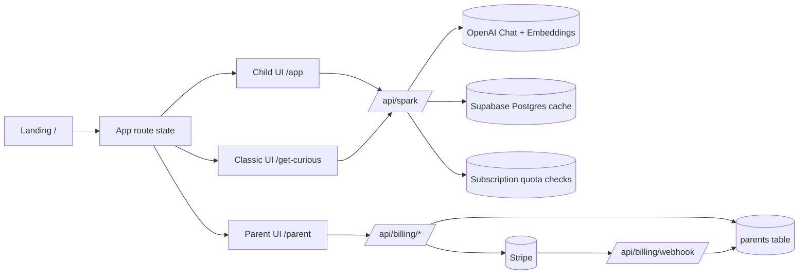
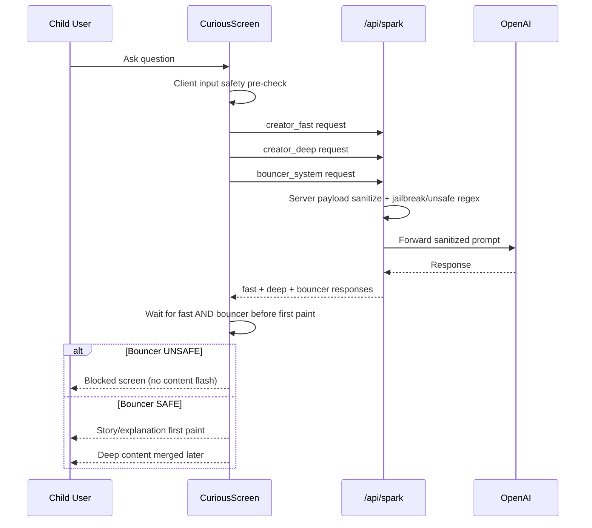

# System Architecture

- Owner: TBD
- Last updated: 2026-04-16
- Status: active
- Related docs:
	[../30-data/DATA_MODEL_AND_RLS.md](../30-data/DATA_MODEL_AND_RLS.md),
	[../40-security/PARENT_PIN_SECURITY_MODEL.md](../40-security/PARENT_PIN_SECURITY_MODEL.md),
	[../50-ops/ENV_AND_DEPLOYMENT_RUNBOOK.md](../50-ops/ENV_AND_DEPLOYMENT_RUNBOOK.md)
- Related code:
	[../../src/App.jsx](../../src/App.jsx),
	[../../api/spark.js](../../api/spark.js),
	[../../api/cache.js](../../api/cache.js),
	[../../src/lib/supabaseClient.js](../../src/lib/supabaseClient.js)

## High-level architecture

1. Frontend web app
- React + Vite single-page app
- route handling done in app runtime with Vercel rewrite to index.html

2. Serverless API
- endpoint /api/spark proxies OpenAI chat calls and cache logic
- endpoint /api/cache (supporting helper module) encapsulates DB cache lookup/store
- billing endpoints handle checkout, portal access, webhook sync, and status

3. Data and auth
- Supabase Postgres for family data + AI cache table
- Supabase Auth with Google OAuth for parent identity

4. External AI
- OpenAI chat models for generation
- OpenAI embeddings for semantic cache lookup

## Runtime topology

## Frontend architecture details

1. Root orchestration in App.jsx
- session bootstrapping
- family data synchronization
- route-mode branching
- child state and parent route gate

2. Parent management surface
- ChildProfilesScreen acts as parent control plane

3. Child learning surfaces
- classic screen chain components
- curious engine component with staged generation pipeline
- journey component for child progress view

4. Shared top-level chrome
- FamilyTopBar displays child identity and journey action
- hidden long-press parent shortcut

## API architecture details

1. spark handler behavior
- method guard (POST only)
- reads manual cache-read flag
- enforces backend-selected model via env (request model from browser is ignored)
- validates and sanitizes request payload with bounded limits
- server-side unsafe input blocking (including prompt-injection/jailbreak patterns)
- returns generic client-facing validation and upstream errors (no policy detail leakage)
- optional cache hit response with diagnostic headers
- OpenAI call on miss
- cache write sync/async controlled by env flag

2. cache module behavior
- query normalization with basic stopword removal
- exact cache lookup by prompt type, model, prompt version, normalized query
- optional semantic fallback using embeddings and per-prompt thresholds
- per-prompt TTL and prompt-version separation

3. diagnostics
- cache policy and status headers
- timing logs for lookup/store/upstream phases

## Safety pipeline (curious flow)

## Route model

1. / -> landing page (marketing + pricing + upgrade CTA)
2. /app -> child curious experience (primary learning surface)
3. /get-curious -> classic topic-card experience
4. /parent -> parent portal with PIN gate
5. /demo, /privacy, /terms -> static/supporting routes

## Configuration model

1. frontend env exposure via Vite prefixes
- VITE_
- SUPABASE_

Important:
- do not define secrets in VITE_* keys
- OpenAI and Stripe secrets must stay server-only

2. backend env usage
- OPENAI_API_KEY
- OPENAI_SERVER_MODEL
- DATABASE_URL or DATABASE_POOLER_URL
- cache policy and prompt-version env keys

## Trust boundaries and enforcement

1. Supabase auth session identifies parent user
2. RLS enforces parent-owned reads/writes for child data
3. Parent PIN is an application-layer gate for parent route UX
4. AI content safety uses client pre-check + server sanitize/block + bouncer on curious flow
5. Bouncer decision is now enforced before first paint in curious flow

## Known architectural tradeoffs

1. Parent PIN verification is client-side (hash+salt pulled by authenticated parent)
2. Parent route gate is app-level, not a server middleware gate
3. Caching policy is manual env-driven to favor operational control
4. Client pre-check improves UX but is not a security boundary; server checks remain authoritative

